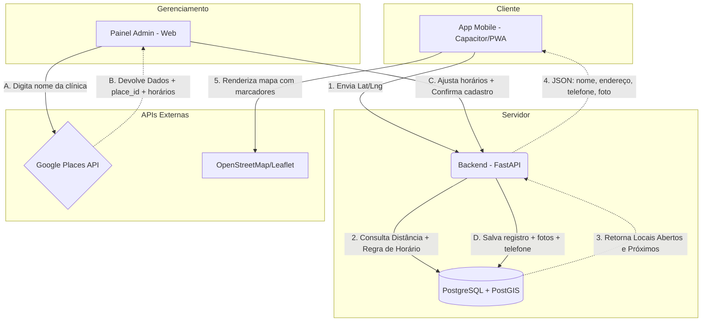

# Arquitetura e Desenho do Sistema: App de Emergência Odontológica

Este documento descreve a arquitetura do sistema, as escolhas tecnológicas e o fluxo de dados para o aplicativo de busca de locais de emergência odontológica.

## Visão Geral

O sistema visa conectar usuários em situações de emergência odontológica aos locais de atendimento mais próximos que estejam **abertos no momento da busca**. O sistema será composto por um Aplicativo Mobile/PWA (para os usuários finais), um Painel Administrativo (para gestão dos locais) e um Backend com Banco de Dados próprio, integrando-se com a Google Places API para enriquecimento de dados **no momento do cadastro**.

> [!NOTE]
> A principal regra de negócio é que **os horários de funcionamento são gerenciados internamente** pelo Painel Admin, garantindo precisão absoluta, enquanto a busca de proximidade é processada pelo nosso banco de dados. O admin utiliza os horários do Google como base, mas pode ajustá-los manualmente.

---

## Stack Tecnológica

### 1. Backend: Python + FastAPI
* **Por que?** Desenvolvimento rápido, alta performance com processamento assíncrono, documentação automática (Swagger/OpenAPI) e facilidade na construção de APIs REST.
* **Função:** Receber requisições do App e do Painel Admin, processar a lógica de negócios, consultar o banco de dados e integrar com a Google Maps Platform.

### 2. Banco de Dados: PostgreSQL + PostGIS
* **Por que?** O PostgreSQL é robusto e confiável. A extensão **PostGIS** é o padrão ouro na indústria para cálculos e buscas geoespaciais (latitude/longitude), permitindo encontrar locais próximos em milissegundos.
* **Função:** Armazenar os dados das clínicas, horários customizados, fotos e dados de contato, e realizar a ordenação por proximidade usando a localização do usuário.

### 3. Frontend Mobile: Web App + Capacitor (PWA-ready)
* **Por que?** Reaproveitamento direto do código HTML/CSS gerado no Stitch. Desenvolvimento extremamente ágil (Go-to-market rápido). O Capacitor atua como uma ponte, permitindo empacotar o site como um aplicativo nativo para Android e iOS e acessar o GPS do aparelho de forma facilitada.
* **Função:** Interface do usuário, captura de localização via GPS, exibição do mapa, marcadores e detalhes das clínicas.
* **PWA:** O app também funcionará como PWA (Progressive Web App), permitindo acesso via navegador sem necessidade de instalação. Isso permite validar a ideia rapidamente antes de publicar nas lojas.

### 4. Painel Admin: Web (HTML/CSS/JS ou framework leve)
* **Por que?** Interface simples para um único administrador. Pode ser construído com o mesmo HTML/CSS do Stitch ou um framework leve como React/Vue.
* **Função:** Cadastro e edição de clínicas, gerenciamento de horários, controle de ativação/desativação.

### 5. Mapa: Leaflet + OpenStreetMap (gratuito)
* **Por que?** O Leaflet é gratuito, open-source e leve. O OpenStreetMap fornece tiles de mapa sem custo. Para o escopo deste projeto, substitui perfeitamente o Google Maps JavaScript API, **eliminando custo por carregamento de mapa**.
* **Função:** Renderizar o mapa interativo no app e no painel admin, exibir marcadores das clínicas.

### 6. Integração Externa: Google Places API (uso controlado)
* **Google Places API:** Usada **apenas no Painel Admin** para:
  - Autocompletar nomes de clínicas durante o cadastro
  - Importar dados básicos (nome, endereço, place_id, telefone, fotos)
  - Importar horários de funcionamento como base inicial
* **Maps JavaScript API:** **Não será utilizada** (substituída pelo Leaflet).
* **Geocoding:** Coordenadas obtidas via Google Places no cadastro ou via Nominatim (gratuito) como fallback.

> [!IMPORTANT]
> **Estratégia de economia:** Ao buscar e armazenar fotos, telefone e avaliações no cadastro (não em tempo real), eliminamos chamadas à API do Google pelo usuário final. O único custo do Google é durante o cadastro de novas clínicas pelo admin — volume baixo e controlável. Com o crédito gratuito mensal de US$ 200, isso cobre centenas de cadastros por mês.

---

## Arquitetura e Fluxo de Dados

O diagrama abaixo ilustra como os componentes se comunicam:



> [!NOTE]
> **Diferença-chave vs. versão anterior:** O app **não chama mais a Google Places API** em tempo real. Todos os dados necessários (fotos, telefone, avaliações) são armazenados no nosso banco no momento do cadastro. Isso reduz o custo para praticamente zero no uso normal.

---

## Modelagem de Dados Principal

### Tabela: `clinicas`
| Campo | Tipo | Descrição |
| :--- | :--- | :--- |
| `id` | UUID (PK) | Identificador único interno |
| `place_id` | String (unique, nullable) | ID do Google Places (chave para sincronização futura) |
| `nome` | String(255) | Nome do estabelecimento |
| `endereco` | String(500) | Endereço completo formatado |
| `localizacao` | Geometry(Point, SRID=4326) | Ponto geográfico (Lat/Lng) usado pelo PostGIS |
| `telefone` | String(20) | Telefone de contato obtido do Google ou inserido manualmente |
| `foto_url` | String(500) | URL da foto da fachada (armazenada localmente ou URL do Google) |
| `avaliacao_google` | Numeric(2,1) | Nota do Google (1.0 a 5.0), armazenada no cadastro |
| `total_avaliacoes` | Integer | Quantidade de avaliações no Google |
| `horarios_funcionamento` | JSONB | Objeto estruturado com horários por dia da semana (ver formato abaixo) |
| `excecoes_horario` | JSONB | Lista de feriados/datas especiais com horários diferenciados |
| `timezone` | String(50) | Timezone da clínica (ex: "America/Sao_Paulo") — padrão "America/Sao_Paulo" |
| `ativo` | Boolean | Controle para o admin pausar a exibição de uma clínica |
| `criado_em` | Timestamp | Data de criação do registro |
| `atualizado_em` | Timestamp | Data da última atualização |

> [!TIP]
> **Formato do JSONB para Horários (`horarios_funcionamento`):**
> ```json
> {
>   "segunda": {"aberto": true, "24h": false, "abre": "08:00", "fecha": "18:00"},
>   "terca": {"aberto": true, "24h": false, "abre": "08:00", "fecha": "18:00"},
>   "quarta": {"aberto": true, "24h": false, "abre": "08:00", "fecha": "18:00"},
>   "quinta": {"aberto": true, "24h": false, "abre": "08:00", "fecha": "18:00"},
>   "sexta": {"aberto": true, "24h": false, "abre": "08:00", "fecha": "18:00"},
>   "sabado": {"aberto": true, "24h": false, "abre": "08:00", "fecha": "12:00"},
>   "domingo": {"aberto": false, "24h": false, "abre": null, "fecha": null}
> }
> ```

> **Formato do JSONB para Exceções (`excecoes_horario`):**
> ```json
> [
>   {"data": "2026-12-25", "aberto": false},
>   {"data": "2026-01-01", "aberto": false},
>   {"data": "2026-04-21", "aberto": true, "abre": "08:00", "fecha": "12:00"}
> ]
> ```

---

## Segurança e Autenticação

### Painel Admin
* Autenticação simples com **JWT** (JSON Web Token).
* Login com email/senha (único admin central).
* Sessão com expiração (ex: 24h).
* Proteção de todas as rotas admin com middleware de verificação de token.

### API Pública (App)
* **Rate limiting** por IP: limitar buscas a 30 requisições/minuto para evitar abuso.
* **CORS** configurado para aceitar apenas domínios do app.
* **API keys do Google** armazenadas apenas no backend — nunca expostas no frontend.

---

## Cache e Performance

### Estratégia de Cache
* **Cache de busca no backend:** Resultados de busca por região podem ser cacheados por 2-5 minutos (em memória com `cachetools` ou Redis se escalar), já que horários de funcionamento mudam no máximo a cada hora.
* **Compressão gzip** habilitada no FastAPI para respostas JSON.
* **Índice geoespacial** (GiST) na coluna `localizacao` — obrigatório para performance do PostGIS.

### Query de Busca Otimizada
A query principal de busca deve:
1. Filtrar por `ativo = true`
2. Verificar o dia da semana atual contra `horarios_funcionamento`
3. Verificar `excecoes_horario` para a data atual (feriados têm prioridade)
4. Verificar se a hora atual (convertida para o timezone da clínica) está dentro do intervalo
5. Calcular distância com `ST_DistanceSphere` e ordenar
6. Limitar a 10-20 resultados

---

## Deploy e Infraestrutura

### Sugestão de Hospedagem (baixo custo)
| Componente | Serviço | Custo estimado |
| :--- | :--- | :--- |
| Backend + DB | **Supabase** (PostgreSQL + PostGIS nativo) ou **Railway** | Gratuito/hobby |
| Backend alt. | **Render** (free tier) + Supabase | Gratuito |
| Frontend/App | **Vercel** ou **Netlify** | Gratuito |
| Admin | Junto com o backend ou Vercel | Gratuito |
| Fotos das clínicas | **Supabase Storage** ou links diretos do Google | Gratuito/low cost |

> [!NOTE]
> Para começar, **Supabase** é a melhor opção pois oferece PostgreSQL com PostGIS nativo, autenticação pronta, storage para fotos e hospedagem — tudo no free tier. O backend FastAPI pode ser hospedado no Render ou Railway.

---

## Casos de Uso Detalhados

### 1. Cadastro Rápido pelo Admin (Otimizado com Places API)
Para evitar que o administrador digite endereços incorretos ou não saiba a latitude/longitude exata:
1. O Admin usa uma barra de pesquisa no Painel Web.
2. Esta barra chama o backend, que consulta o *Text Search* ou *Autocomplete* da Google Places API.
3. O Admin seleciona o resultado correto. O sistema preenche automaticamente: Nome, Endereço, `place_id`, Telefone, Foto e **Horários do Google**.
4. O Admin revisa e ajusta os **Horários de Funcionamento** conforme necessário.
5. O sistema salva tudo no banco de dados, incluindo foto e telefone.

### 2. Busca por Emergência no App (A Regra de Ouro)
Quando um usuário abre o app:
1. O app (Capacitor/PWA) obtém a coordenada `Lat X, Lng Y` do dispositivo via GPS ou permissão do navegador.
2. A requisição vai para o FastAPI.
3. O backend executa a query SQL no PostGIS que traduzida significa:
   - *"Traga clínicas ativas"*
   - *"Verifique se hoje é exceção (feriado) — se sim, use a regra da exceção"*
   - *"Senão, verifique o dia da semana atual em `horarios_funcionamento`"*
   - *"E que (sejam 24h) OU (a hora atual no timezone da clínica esteja entre 'abre' e 'fecha')"*
   - *"Calcule a distância até a coordenada (X, Y) e ordene da menor para a maior"*
   - *"Retorne as 15 mais próximas"*
4. O app renderiza o mapa Leaflet com os marcadores e a lista de clínicas.

### 3. Detalhes da Clínica (Sem chamada à API externa)
1. O usuário clica em uma clínica no mapa ou na lista.
2. O app exibe os detalhes **do nosso banco de dados**: nome, endereço, telefone, foto, avaliação, horários.
3. Um botão "Ligar" inicia uma chamada direta para o telefone da clínica.
4. Um botão "Abrir no Maps" abre o Google Maps ou Waze com a coordenada para navegação.

> [!IMPORTANT]
> **Economia e Escalabilidade:** Esta arquitetura é extremamente econômica. A busca principal é realizada *gratuitamente* em nosso próprio servidor PostgreSQL. O mapa usa OpenStreetMap (gratuito). O faturamento da API do Google só ocorre durante cadastros pelo admin (volume baixo). O app do usuário final não gera nenhum custo de API externa.

---

## Pontos de Atenção e Decisões Futuras

1. **Sincronização com Google:** Periodicamente (ex: mensal), o admin pode re-importar dados do Google para atualizar fotos/avaliações. Implementar botão "Atualizar do Google" por clínica.
2. **Feriados automáticos:** Considerar integração com a API gratuita de feriados nacionais do Brasil (`brasilapi.com.br/api/feriados/v1/{ano}`) para preencher `excecoes_horario` automaticamente.
3. **Multi-timezone:** O padrão é `America/Sao_Paulo`, mas o campo `timezone` permite cobrir Acre, Amazonas, Fernando de Noronha se o escopo geográfico expandir.
4. **Analytics:** Implementar contagem simples de buscas e cliques por clínica para métricas futuras.
5. **Se o app crescer:** Migrar fotos para CDN, adicionar Redis para cache, considerar réplicas de leitura no Postgres.
